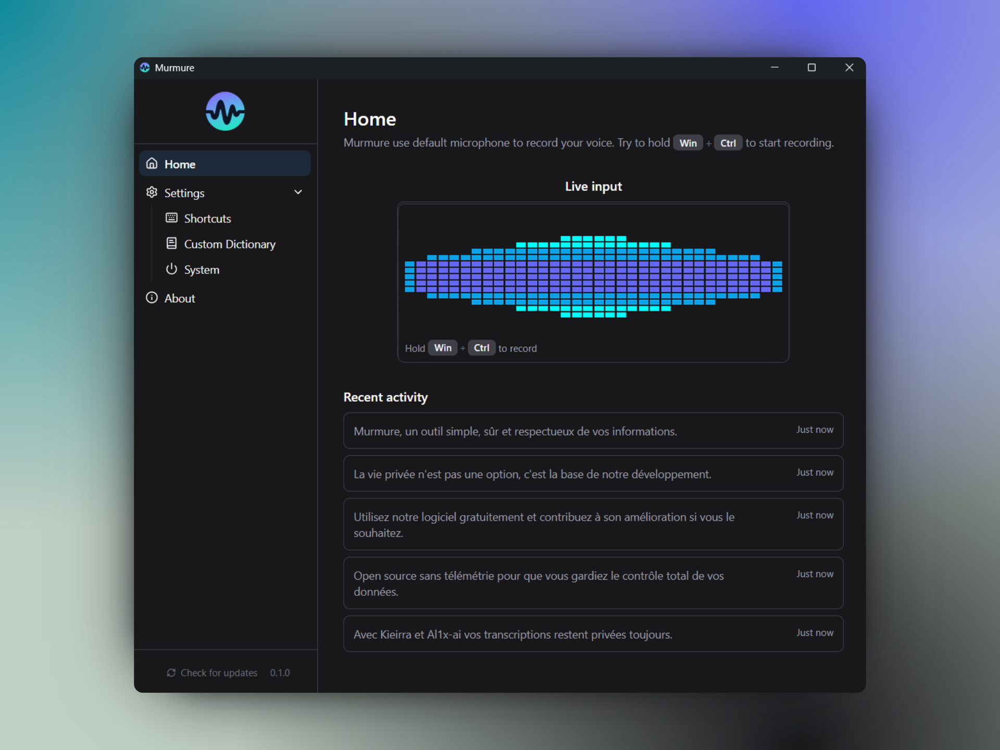

# Murmure

A privacy-first, open-source speech-to-text application that runs entirely on your machine, powered by a neural network via NVIDIA’s [Parakeet TDT 0.6B v3 model](https://huggingface.co/nvidia/parakeet-tdt-0.6b-v3) for fast, local transcription. Murmure turns your voice into text with no internet connection and zero data collection, and supports 25 European languages.

Learn more on the [official website](https://murmure.al1x-ai.com/) | [Documentation](https://docs.murmure.app)



## Features

- **Privacy First**: All processing happens locally on your device. No data ever leaves your computer.
- **No Telemetry**: Zero tracking, zero analytics. Your data stays yours, always.
- **Open Source**: Free and open source software. Inspect, modify, and contribute.
- **Powered by [Parakeet TDT 0.6B v3](https://huggingface.co/nvidia/parakeet-tdt-0.6b-v3)**: NVIDIA’s latest state-of-the-art speech recognition model runs entirely on-device for fast, low-latency transcription.
- **Multilingual**: Supports 25 languages!

<details>
<summary>List of supported languages</summary>
Bulgarian (bg), Croatian (hr), Czech (cs), Danish (da), Dutch (nl), English (en), Estonian (et), Finnish (fi), French (fr), German (de), Greek (el), Hungarian (hu), Italian (it), Latvian (lv), Lithuanian (lt), Maltese (mt), Polish (pl), Portuguese (pt), Romanian (ro), Slovak (sk), Slovenian (sl), Spanish (es), Swedish (sv), Russian (ru), Ukrainian (uk)
</details>

## Usage

Murmure provides a clean and focused speech-to-text experience.
Once launched, simply start recording your voice. The text appears instantly, processed directly on your computer.

Typical use cases include:

- Dictating to any AI prompt (Cursor, ChatGPT, Mistral, Claude code, etc.)
- Writing notes hands-free
- Capturing creative ideas or dictation
- Post processing with a local LLM to translate, fix grammar, etc.

Because all computation is local, no network connection is required.

## Installation

### Windows (Official)

> [!IMPORTANT]
> Murmure requires **Windows 10 or later**. Older versions (such as Windows 8.1) are not supported and may result in missing system libraries (e.g. `dxcore.dll`).

Multiple installation methods are available:

- Using a `.msi` or `setup.exe` file:
    1. Go to the [release](https://github.com/Kieirra/murmure/releases) page and download the latest Murmure_x64.msi (or Murmure_x64-setup.exe).
    2. Run the installer and follow the setup wizard.

- Via WinGet:
    1. Open the `Console` app via the Windows start menu.
    2. Inside the console, paste `winget install Kieirra.Murmure` and follow the instructions. (`--scope user` will be available in the future)

> [!IMPORTANT]
> Murmure requires the [Microsoft Visual C++ Redistributable](https://learn.microsoft.com/cpp/windows/latest-supported-vc-redist) to work on Windows. This package is present on most computers, but if you encounter the error message `The code execution cannot proceed because MSVCP140.dll was not found. Reinstalling the program may fix this problem.`, download and install the package from the official page or use this direct download link: [https://aka.ms/vc14/vc_redist.x64.exe](https://aka.ms/vc14/vc_redist.x64.exe)

> ⚠️ Antivirus Notice : Some users reported that Kaspersky may block Murmure. If needed, please add Murmure as an exclusion in your antivirus settings.

### Linux (Official)

> [!NOTE]
> **Wayland**: Two shortcut modes are available. KDE Plasma 6, Hyprland, and Sway use the `xdg-desktop-portal` GlobalShortcuts portal with no manual setup. GNOME defaults to CLI mode: you must configure a custom OS shortcut before using Murmure, and Push-to-talk is not available. See the [Linux installation guide](https://docs.murmure.app/getting-started/linux/) and the [shortcut configuration guide](https://docs.murmure.app/configure-shortcuts-on-linux/).

Multiple installation methods are available:

- Quick install via terminal (Debian-based distributions):

    ```sh
    curl -fsSL https://raw.githubusercontent.com/Kieirra/murmure/main/install.sh | sh
    ```

- Using a `.deb` file (Debian-based distributions):
    1. Go to the [release](https://github.com/Kieirra/murmure/releases) page and download the latest `Murmure_amd64.deb`.
    2. Install it: `sudo dpkg -i Murmure_amd64.deb`

- Using an AppImage:
    1. Download `Murmure_amd64.AppImage` from the [release](https://github.com/Kieirra/murmure/releases) page.
    2. Make it executable: `chmod +x Murmure_amd64.AppImage`
    3. Run the AppImage.

### MacOS (Official)

1. Download **Murmure_aarch64_darwin.dmg** from the [release](https://github.com/Kieirra/murmure/releases) page
2. Drag Murmure to the Applications folder, then open it from there.
3. Murmure should ask for permissions to access your microphone and accessibility.
4. Restart Murmure for the permissions to take effect.

> [!IMPORTANT]
> **Updating Murmure on macOS from 1.6.0:** If you experience issues with Murmure and the shortcuts are not working, please do this exactly in this order, (and "Remove" means not only un-toggling but really removing completely Murmure from the list) :

1. Remove Murmure from System Settings → Privacy & Security → Accessibility.
2. Remove Murmure from System Settings → Privacy & Security → Input monitoring.
3. Install the last version
4. Launch Murmure.
5. Re-grant the Accessibility
6. Re-grant the Input monitoring permission
7. Restart Murmure.

it should work. It's a bit painful but you will not do it again with the next version, it's because 1.6.0 have the same name but is not detected as the same application... so macos is lost.

### MacOS - Intel (Official)

1. Download **Murmure_x86_64_darwin.dmg** from the [release](https://github.com/Kieirra/murmure/releases) page
2. Drag Murmure to the Applications folder, then open it from there.
3. Murmure should ask for permissions to access your microphone and accessibility.
4. Restart Murmure for the permissions to take effect.

The same upgrade note from 1.6.0 applies. See the MacOS section above.

## CLI Import (1.8.0)

Murmure supports importing a `.murmure` configuration file via the command line (`murmure import config.murmure`), useful for mass deployment or sharing settings across machines. A `--strategy merge` option is available to keep existing settings. See the [CLI documentation](https://docs.murmure.app/features/cli/) for details.

## Changelog

See [CHANGELOG.md](./CHANGELOG.md).

## 🗺️ Roadmap

### 1.9.0

- [x] feat(virtual-mic): Smart Speech Mic - use your phone as a wireless microphone by scanning a QR code in Murmure, no installation required on the phone
- [x] style(layout): Add an Extensions section in the menu to better organize features
- [x] style(layout): Global UX/UI optimization to simplify the interface and prioritize benefits over information
- [x] docs: Official documentation for Murmure (configuration, limitations, tips, etc.) https://kieirra.github.io/murmure/
- [x] fix(sidebar): Disable mobile mode for sidebar to prevent it from disappearing on high-scaling displays
- [x] feat(overlay): Configure overlay size
- [x] style(overlay): Color-coded visualizer per recording mode (standard, LLM, command)
- [x] feat(overlay): Real-time streaming preview with configurable text width, font size and max lines
- [x] fix(overlay): Error messages disappearing too quickly and blocking subsequent recordings
- [x] fix(updater): macOS auto-update not working (wrong artifact format) https://github.com/Kieirra/murmure/issues/301
- [x] fix(shortcuts): MacOs Cancel shortcut (Escape) no longer blocks other apps when not recording https://github.com/Kieirra/murmure/issues/302
- [x] perf(bundle): Shrink Rust binary by 32% (66 MB → 45 MB) and trim unused dependencies (thanks @BorisLord) https://github.com/Kieirra/murmure/pull/310
- [x] fix(voice-mode): Wake word not detected when spoken mid-sentence without a pause
- [x] feat(linux): Native Wayland support via xdg-desktop-portal GlobalShortcuts (experimental, KDE recommended)
- [x] fix(tray): macOS tray icon now adapts to light/dark mode using a template image (thanks @fwehrling) https://github.com/Kieirra/murmure/pull/312
- [x] perf(llm): skip Ollama warmup when model is already loaded (thanks @BorisLord) https://github.com/Kieirra/murmure/pull/324
- [x] fix(ui): use bundled asset for sidebar logo to avoid subroute 404 (thanks @BorisLord) https://github.com/Kieirra/murmure/pull/323
- [x] fix: Log time not displayed in the correct timezone
- [x] feat(shortcuts) : do not display LLM Connect shortcut if not enabled
- [x] feat(shortcuts): Add a shortcut to toggle Voice Mode on/off https://github.com/Kieirra/murmure/issues/279
- [x] fix(audio): First start/stop sound after a cold start was sometimes silent because the audio device was not warmed up
- [x] feat(tray): Show a recording indicator on the tray icon during transcription, visible even when the overlay is hidden
- [x] feat(rules): Allow adding a custom name for personal formatting rules
- [x] feat(tray): Copy the last transcript directly from the tray menu
- [x] feat(linux): RPM bundle for Fedora-based distributions
- [x] feat(dictionary): Warn when entering digits in a dictionary entry and link to the formatting rules
- [x] feat(import-export): Include Voice Mode and Smart Mic categories in the import/export of settings
- [x] fix(shortcuts): Some AZERTY keys (e.g. ²) could not be bound
- [x] fix(formatting-rules): Preserve user formatting rules when upgrading from pre-1.8.0
- [ ] fix(shortcuts): Clarify LLM Connect vs Command shortcut descriptions in settings
- [ ] fix(linux): Disable Smart Mic on Wayland
- [ ] fix(linux): Change the default Cancel shortcut on Wayland
- [ ] fix(linux): Disable push-to-talk on Wayland
- [ ] fix(linux): Retry shortcut registration on Wayland portal when BindShortcuts returns Unavailable

### Backlog

- [ ] (1.10.0) feat(shortcuts): Delete key removes the selected shortcut
- [ ] (1.10.0) fix(shortcuts): Prevent adding a duplicate shortcut
- [ ] (1.10.0) feat(dictionary): Virtualize the list to handle large dictionaries
- [ ] (1.10.0) feat(dictionary): Improve dictionary accuracy via Parakeet phrase boosting https://github.com/Kieirra/murmure/issues/338
- [ ] (1.10.0) feat(overlay): Close button to cancel an ongoing transcription https://github.com/Kieirra/murmure/discussions/305#discussioncomment-16928389
- [ ] (1.10.0) feat(llm): Built-in prompt preset for input anonymisation
- [ ] (1.10.0) fix(visualizer): Lower or dynamically adjust input sensitivity
- [ ] (1.10.0) fix(visualizer): Always reset the visualizer at the end of a transcription
- [ ] (1.10.0) fix(api): Remove the experimental tag and consolidate the API
- [ ] (1.10.0) fix(api): Implement LLM Connect service
- [ ] (1.10.0) feat(insert): None option for Text Insert Mode to disable auto-insertion https://github.com/Kieirra/murmure/issues/349
- [ ] (under consideration) (1.10.0) fix(api): Auto-split long audio for LLM transcription
- [ ] (under consideration) (1.10.0) feat(draft): Draft Mode to review and edit a transcription before writing (medical use case)
- [ ] (under consideration) feat(llm): Auto-detect Ollama on first LLM Connect setup

## Contributing

See [CONTRIBUTING.md](./CONTRIBUTING.md).

Reporting issues is done [on GitHub](https://github.com/Kieirra/murmure/issues/new).

### Privacy Policy

See [PRIVACY_POLICY.md](./PRIVACY_POLICY.md).

## Sponsors

<table>
  <tr>
    <td></td>
    <td>Free code signing on Windows provided by <a href="https://about.signpath.io/">SignPath.io</a>, certificate by <a href="https://signpath.org/">SignPath Foundation</a></td>
  </tr>
</table>

## Support Development

If you like Murmure and want to support its development: [Support on Tipeee](https://fr.tipeee.com/murmure-al1x-ai/)

## License

Murmure is free and open source, released under the GNU AGPL v3 License.
You can inspect, modify, and redistribute it freely as long as derivative works remain open source.

## Acknowledgments

- Thanks to NVIDIA for releasing the model [Parakeet TDT 0.6B v3](https://huggingface.co/nvidia/parakeet-tdt-0.6b-v3)
- [Tauri](https://github.com/tauri-apps/tauri) for being an amazing tool
- The open‑source community for their tools and libraries.
