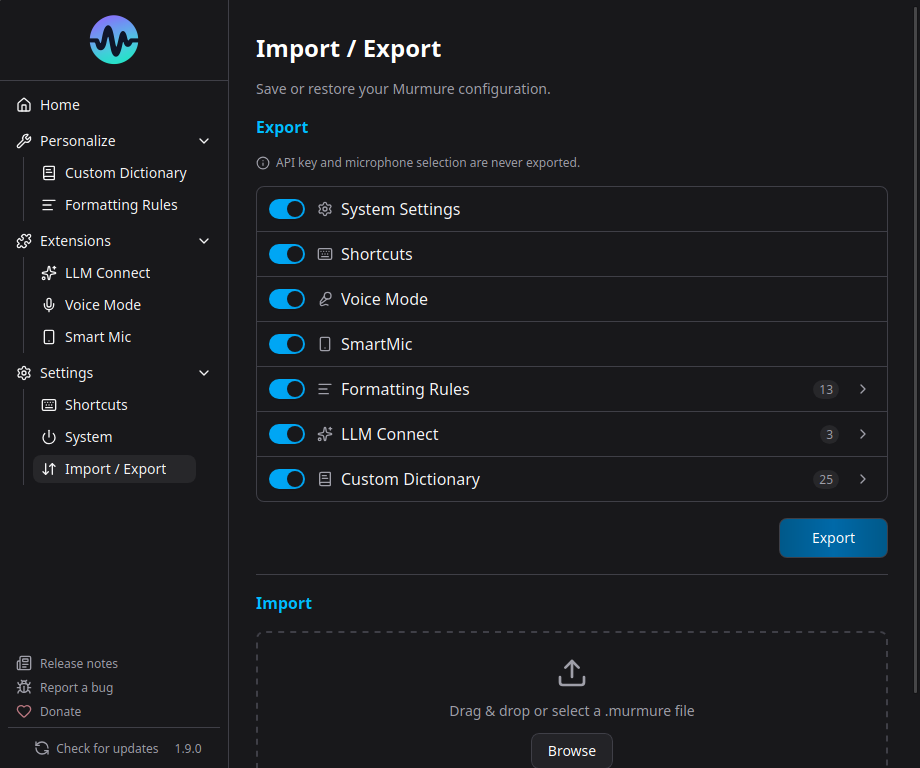

# CLI

Starting from version 1.8.0, Murmure provides a command-line interface for importing configuration files. This is useful for IT administrators deploying Murmure across multiple workstations or for sharing settings between machines.

## Usage

```bash
murmure import <FILE> [OPTIONS]
```

### Commands

| Command                                    | Description                          |
| ------------------------------------------ | ------------------------------------ |
| `murmure --help`                           | Show help                            |
| `murmure --version`                        | Show version                         |
| `murmure import <FILE>`                    | Import a .murmure configuration file |
| `murmure import <FILE> --strategy replace` | Replace all settings (default)       |
| `murmure import <FILE> --strategy merge`   | Merge with existing settings         |

### Import Strategies

- **replace** (default) - Overwrites all existing settings with the imported ones
- **merge** - Keeps existing settings and adds new ones from the import file. Existing values are preserved.

## Platform-Specific Paths

=== "Linux"

    ```bash
    murmure import config.murmure
    # or with merge strategy
    murmure import config.murmure --strategy merge
    ```

=== "macOS"

    ```bash
    /Applications/murmure.app/Contents/MacOS/murmure import config.murmure
    ```

=== "Windows"

    ```powershell
    murmure.exe import config.murmure
    ```



## The .murmure File Format

The `.murmure` file is a JSON file with the following structure:

```json
{
  "version": 1,
  "settings": { ... },
  "shortcuts": { ... },
  "formatting_rules": { ... },
  "llm_connect": { ... },
  "dictionary": { ... }
}
```

Each section is optional - you can import only the parts you need.

## Use Cases

### IT Mass Deployment

Combine with silent MSI install for deploying pre-configured Murmure:

```powershell
# Install silently
msiexec /package Murmure_x64.msi /quiet

# Import company configuration
murmure.exe import company-config.murmure
```

### Sharing Settings

Export your settings from Murmure, share the `.murmure` file, and the recipient imports it:

```bash
murmure import colleague-settings.murmure --strategy merge
```

## Notes

- CLI operations are fast - they detect early and skip full app initialization
- If Murmure is already running, the import triggers a hot-reload of settings
- The import validates the file format and version before applying
