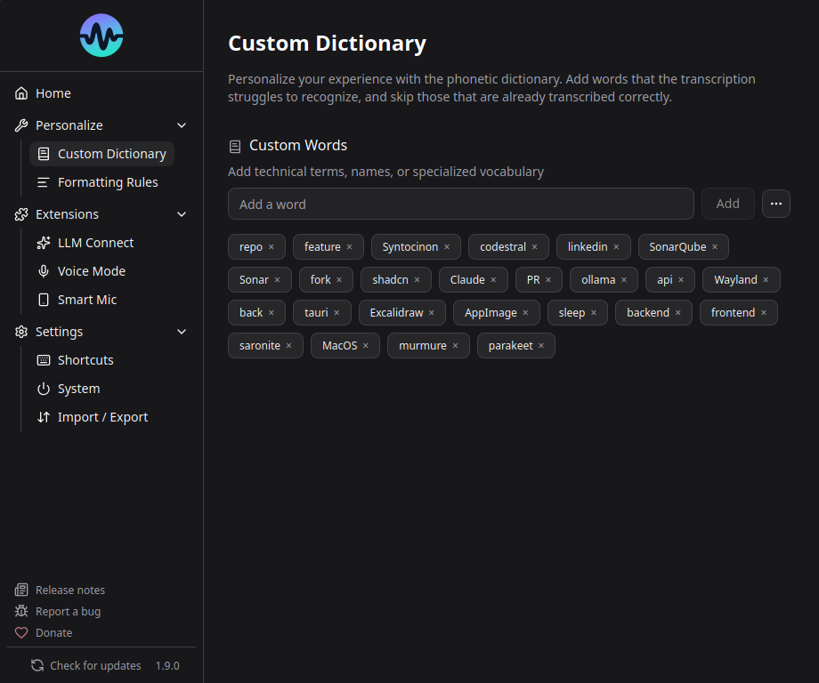

# Dictionnaire

Le dictionnaire aide Murmure a reconnaitre des mots qu'il pourrait autrement manquer ou mal orthographier - noms propres, termes techniques, noms de marques, etc.

## Fonctionnement

Les mots du dictionnaire sont favorises directement pendant le decodage ASR : quand l'audio est compatible avec une de vos entrees, Parakeet est pousse a la transcrire. Une passe de correction orthographique rattrape ensuite les quasi-erreurs, mais seulement quand le modele n'etait pas sur de ce qu'il a entendu, donc les mots courants clairement prononces ne sont jamais remplaces par des entrees du dictionnaire.

**Exemple** : Vous ajoutez "Kieirra" au dictionnaire. Quand Parakeet aurait transcrit "Kierra" ou "Kyera", le dictionnaire corrige en "Kieirra".

## Ajouter des mots

1. Allez dans **Parametres** > **Dictionnaire** (ou la section Personnaliser)
2. Tapez le mot et cliquez sur Ajouter
3. Le mot est immediatement actif

## Bonnes pratiques

!!! warning "Moins c'est mieux"
    Le dictionnaire fonctionne mieux avec une liste courte et ciblee. Chaque entree est un candidat que le decodage considere, donc des centaines d'entrees augmentent le risque de faux positifs.

**A faire :**

- Ajouter les noms propres que Parakeet rate systematiquement
- Ajouter les termes techniques specifiques a votre domaine
- Ajouter les acronymes qui doivent etre en majuscules

**A eviter :**

- Ajouter des listes entieres de medicaments ou des glossaires complets
- Ajouter des mots courants que Parakeet gere deja bien
- Ajouter des mots avec des chiffres (non supporte - utilisez les [Regles de formatage](formatting-rules.md))

### Que se passe-t-il avec un gros dictionnaire ?

Des garde-fous s'adaptent automatiquement : le boost de decodage s'affaiblit quand le dictionnaire grossit, et la correction orthographique est desactivee au-dela de 100 entrees (les correspondances exactes gardent leur casse de dictionnaire). N'ajoutez que les mots frequemment mal reconnus.

## Limitations du dictionnaire

- **Pas de chiffres** - Les entrees contenant des chiffres sont refusees. Utilisez les [Regles de formatage](formatting-rules.md)
- **Un ou deux mots** - Une entree contient au maximum un espace
- **Pas de comprehension du contexte** - Les mots sont rapproches par le son et l'orthographe, pas par le sens

Les lettres, accents, ponctuations et traits d'union sont supportes.

Pour les remplacements complexes, utilisez les [Regles de formatage](formatting-rules.md) avec regex.

## Import / Export

- **Exporter** : Enregistre votre dictionnaire dans un fichier `.txt`
- **Importer** : Charge les entrees d'un fichier `.txt` et les fusionne avec votre dictionnaire actuel
- **Tout supprimer** : Supprime toutes les entrees

### Format du fichier

Le fichier dictionnaire est un fichier texte avec **une entree par ligne** :

    Kubernetes
    Parakeet
    Murmure

- Encodage UTF-8
- Les lignes vides sont ignorees
- Les espaces en debut et fin de ligne sont retires
- Chaque entree doit respecter les regles du dictionnaire : pas de chiffre, un espace au maximum

L'import **ajoute** les entrees a votre dictionnaire, il ne le remplace jamais. Les entrees deja presentes sont ignorees, quelle que soit leur casse.

!!! note "Anciens exports `.csv`"
    Murmure exportait auparavant les dictionnaires avec une extension `.csv`. Ces fichiers restent acceptes a l'import. Si une ligne contient une virgule ou un point virgule, seule la partie precedant le premier separateur est conservee, et une ligne d'en tete comme `mot` est ignoree. Pour importer un fichier tel quel, renommez le en `.txt`.

Des presets medicaux sont disponibles.
