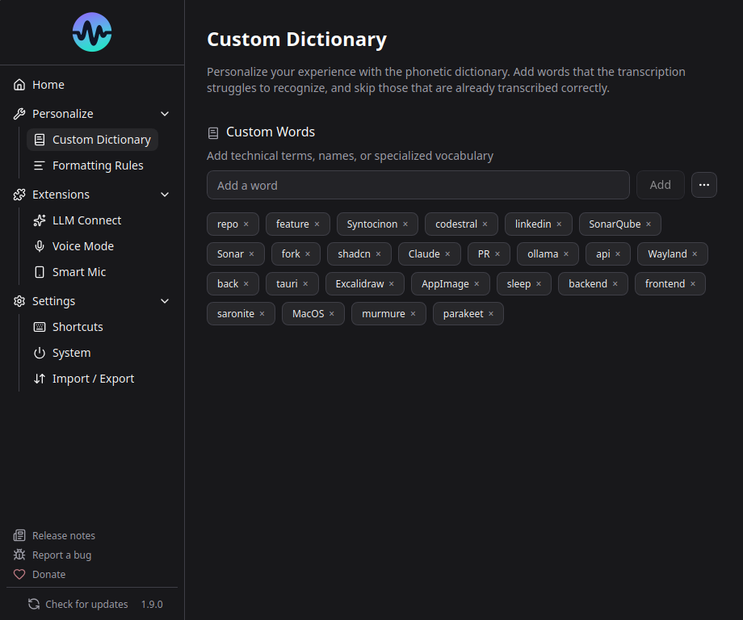

# Dictionary

The dictionary helps Murmure recognize words it might otherwise miss or misspell - proper nouns, technical terms, brand names, etc.

## How It Works

Murmure uses a phonetic matching algorithm (Beider-Morse) to compare what Parakeet transcribed against your dictionary entries. If a spoken word sounds similar to a dictionary entry, it's replaced.

**Example**: You add "Kieirra" to the dictionary. When you say "Kieirra" and Parakeet transcribes "Kierra" or "Kyera", the dictionary corrects it to "Kieirra".

## Adding Words

1. Go to **Settings** > **Dictionary** (or the Personalize section)
2. Type the word and click Add
3. The word is immediately active for future transcriptions

## Best Practices

!!! warning "Less is more"
    The dictionary works best with a small, targeted list of words. Adding too many entries (especially hundreds of similar-sounding words) **degrades transcription quality**.

**Do:**

- Add proper nouns that Parakeet consistently gets wrong (company names, people's names)
- Add technical terms specific to your field
- Add acronyms that should be capitalized (e.g., "LAMOTRIGINE", "NestJS")

**Don't:**

- Add entire medication lists or full glossaries
- Add common words that Parakeet already handles well
- Add words with numbers or special characters (not supported - use [Formatting Rules](formatting-rules.md) instead)

### Why Does a Large Dictionary Hurt Quality?

The phonetic matching algorithm matches aggressively when many similar-sounding entries exist. For example, adding 200 medical terms can cause "a" to be matched to "eau", or random prefixes to appear. Only add words that are frequently mis-recognized.

## Dictionary Limitations

- **Alphabetical characters only** - Numbers, hyphens, and special characters are not supported in dictionary entries
- **Single words only** - Multi-word phrases are not supported
- **Phonetic matching only** - The algorithm matches by sound, not by context

For complex replacements (multi-word, with numbers, context-dependent), use [Formatting Rules](formatting-rules.md) with regex instead.

## Import / Export

You can import and export your dictionary for backup or sharing:

- **Export**: Downloads your dictionary as a file
- **Import**: Loads words from a previously exported file
- **Clear all**: Removes all dictionary entries

Medical presets are available for common medical terminology.
