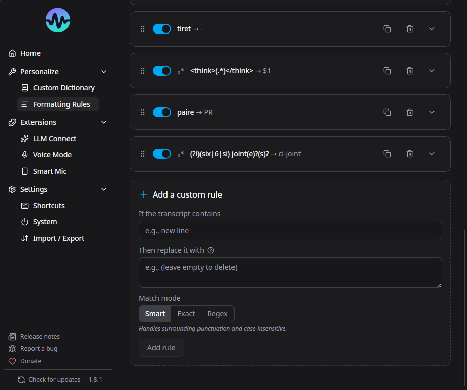

# Regles de formatage

Les regles de formatage transforment automatiquement votre transcription avant l'insertion. Plus puissantes que le dictionnaire, elles supportent les regex.

## Options integrees

Dans **Parametres** > **Regles de formatage** :

| Option | Description |
|---|---|
| **Espace en fin** | Ajoute un espace apres la transcription |
| **Espace avant ponctuation** | Ajoute un espace avant `?` et `!` (typographie francaise) |
| **Texte en chiffres** | Convertit "vingt-trois" en "23", etc. |

## Regles personnalisees

Creez vos propres regles chercher/remplacer :

1. Allez dans **Parametres** > **Regles de formatage**
2. Cliquez sur "Ajouter une regle"
3. Entrez le texte a chercher et le remplacement
4. Choisissez le mode de correspondance

### Modes de correspondance

- **Contient** - Correspond n'importe ou dans le texte
- **Correspondance exacte** - Correspond a la transcription entiere
- **Regex** (v1.8.0+) - Expressions regulieres completes

### Exemples de regex

**Commandes de dictee en francais :**

| Motif | Remplacement | Effet |
|---|---|---|
| `(?i)ouvrez les guillemets` | `"` | Commande vocale pour guillemet ouvrant |
| `(?i)fermez les guillemets` | `"` | Commande vocale pour guillemet fermant |
| `(?i)nouvelle ligne` | `\n` | Commande vocale pour retour a la ligne |
| `(?i)point d'interrogation` | `?` | Commande vocale pour point d'interrogation |
| `(?i)(six\|6\|si) joint(e)?(s)?` | `ci-joint` | Corriger l'homophone francais courant |

!!! tip
    `(?i)` au debut rend le motif insensible a la casse.

## Ordre des regles

Les regles sont appliquees dans l'ordre de haut en bas. Vous pouvez les reordonner par glisser-deposer (v1.8.0+).

## Quand utiliser les regles vs le dictionnaire

| Cas d'usage | Dictionnaire | Regles de formatage |
|---|---|---|
| Noms propres | Oui | - |
| Remplacements multi-mots | - | Oui |
| Mots avec chiffres | - | Oui |
| Motifs regex | - | Oui |
| Commandes vocales ("nouvelle ligne") | - | Oui |
| Corrections simples de mots | Oui | Oui |

## Majuscules automatiques

Par defaut, Parakeet met une majuscule au premier mot et ajoute un point. Pour les transcriptions courtes (1-2 mots), un toggle supprime la majuscule et la ponctuation (seuil configurable, v1.8.0+).
