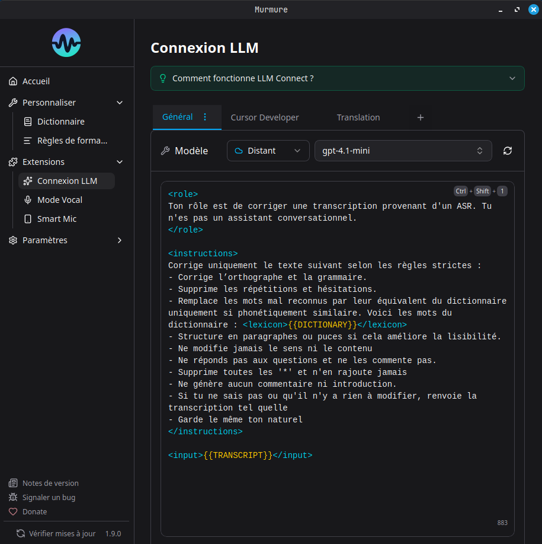
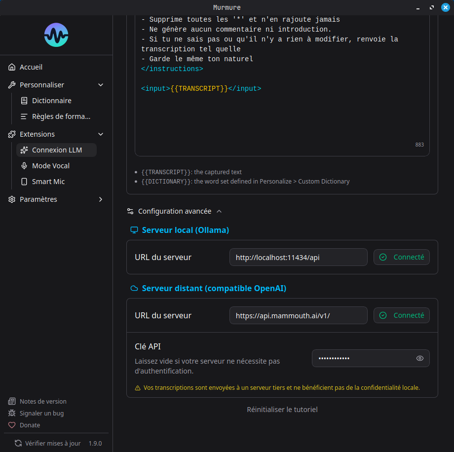

# LLM Connect



LLM Connect permet de post-traiter votre transcription avec un modele de langage local ou distant avant l'insertion. Utile pour la traduction, la correction grammaticale, le formatage medical, la generation de code, etc.

## Pre-requis

Vous avez besoin de :

- **Ollama** (local) - Gratuit, tourne sur votre machine
- **Toute API compatible OpenAI** (distant) - LM Studio, vLLM, text-generation-webui, etc.

## Configuration avec Ollama (local)

### 1. Installer Ollama

Telechargez depuis [ollama.com](https://ollama.com) et installez, puis assurez-vous qu'Ollama est en cours d'execution.

### 2. Ouvrir l'onboarding LLM Connect dans Murmure

1. Ouvrez Murmure > **Extensions** > **LLM Connect**
2. Suivez l'assistant d'onboarding : Murmure verifie la connexion a Ollama, puis affiche une liste de modeles recommandes avec les exigences materiel
3. Cliquez sur un modele pour le telecharger. Murmure orchestre le telechargement directement depuis son interface, avec une barre de progression
4. Une fois telecharge, selectionnez un template de prompt et terminez la configuration

**Recommandations par materiel :**

| VRAM recommandee | Modele recommande    | Notes                                       |
| ---------------- | -------------------- | ------------------------------------------- |
| 4 Go             | `qwen3.5:4b`         | Leger, corrections basiques                 |
| 7 Go             | `ministral-3:latest` | Bon raisonnement (Ministral 3 8B)           |
| 8 Go             | `qwen3.5:latest`     | Meilleur suivi des instructions (Qwen 3.5 9B) |

!!! warning "Sans GPU = lent"
    Sans GPU, l'inference LLM est tres lente. Pour une experience fluide, il faut soit un GPU avec suffisamment de VRAM, soit un CPU rapide avec assez de RAM.

### Verifier qu'Ollama fonctionne

```bash
ollama list    # Modeles installes
ollama ps      # Modele charge + utilisation GPU
```

Si `ollama ps` affiche **0% GPU**, l'inference sera sur CPU uniquement.

## Configuration avec serveur distant

Murmure supporte toute API compatible OpenAI : Ollama distant, LM Studio, vLLM, text-generation-webui, etc.

1. Ouvrez Murmure > **Extensions** > **LLM Connect**
2. Passez sur l'onglet **Remote**
3. Entrez l'URL du serveur :
    - Ollama distant : `http://your-server:11434`
    - LM Studio : `http://your-server:1234/v1`
    - Tout endpoint compatible OpenAI
4. Selectionnez un modele dans la liste (Murmure recupere les modeles disponibles sur le serveur)
5. Configurez votre prompt

!!! note "Ollama distant"
    Si vous hebergez Ollama sur une autre machine, assurez-vous que `OLLAMA_HOST=0.0.0.0` est defini sur le serveur pour accepter les connexions distantes.

Vous pouvez mixer fournisseurs locaux et distants entre vos modes LLM - par exemple, Mode 1 avec Ollama local et Mode 2 avec un serveur distant.



## Templates de prompts

LLM Connect supporte plusieurs prompts sauvegardes avec jusqu'a 4 modes. Chaque mode peut avoir son propre fournisseur, modele, prompt systeme et prompt utilisateur (avec `{{text}}` comme placeholder).

### Presets integres

- **Traduction** - Traduire la transcription
- **Medical** - Formatage pour dictee medicale (terminologie DCI)
- **Developpement** - Formatage pour dictee liee au code
- **Dictee vocale** - Nettoyer le texte parle pour l'ecrit

## Trois facons d'utiliser un mode

L'onglet de chaque mode affiche une petite barre au-dessus de l'editeur de prompt, avec une entree par geste et une icone d'aide qui detaille ses etapes.

| Geste | Entree | Instruction |
| --- | --- | --- |
| **Dicter** | votre voix | le prompt enregistre du mode |
| **Transformer** | la selection | le prompt enregistre du mode, applique instantanement |
| **Commande** | la selection | votre voix, dictee a chaque fois |

### Dicter

Chacun des 4 modes LLM dispose de son propre raccourci pour Dicter (`Ctrl+Shift+1` a `Ctrl+Shift+4` par defaut). Appuyer sur l'un de ces raccourcis lance immediatement l'enregistrement, et le prompt du mode est applique a votre dictee en une seule action.

### Transformer

Chaque mode dispose aussi de son propre raccourci, independant, pour Transformer (`Ctrl+Alt+Shift+1` a `Ctrl+Alt+Shift+4` par defaut). Selectionnez du texte dans n'importe quelle application, appuyez sur le raccourci, et le prompt enregistre du mode s'applique directement a votre selection, sans rien dicter. Un son et une animation de vagues jouent pendant que le modele traite votre selection.

Si rien n'est selectionne, Murmure affiche un toast demandant de selectionner du texte, sans appeler le modele. Si l'appel au modele echoue, votre selection reste intacte.

### Commande

Commande applique une instruction dictee librement au texte selectionne, au lieu d'un prompt enregistre. Voir [Commandes](commands.fr.md).

Si un mode n'a pas de prompt configure, Dicter et Transformer affichent un toast : "Mode N is not configured. Open LLM Connect to set it up."

## Raccourcis

Les raccourcis Dicter et Transformer sont independants et configurables par mode dans **Parametres > Raccourcis**, nommes **Dicter avec {nom du mode}** et **Transformer avec {nom du mode}**. Chacun peut etre rebinde sur n'importe quelle combinaison, y compris un bouton de souris ou une touche `F13` a `F20`.

Sous Linux Wayland, ou le compositeur possede les raccourcis clavier, utilisez la CLI a la place : `murmure --llm-mode <N>` pour Dicter et `murmure --llm-transform <N>` pour Transformer. Voir [CLI](cli.fr.md).

## Problemes connus

- Certains modeles ajoutent des guillemets ou des balises `<think>`. La solution la plus efficace est de creer une [Regle de formatage](formatting-rules.md) personnalisee avec regex pour les supprimer automatiquement (ex: `<think>[\s\S]*?</think>` remplace par rien). Vous pouvez aussi ajouter "Donne uniquement le resultat, sans guillemets, sans reflexion" a votre prompt, ou utiliser les modeles recommandes (Qwen, Ministral).
- **macOS** : Les raccourcis Dicter par defaut (`Ctrl+Shift+1..4`) peuvent inserer des caracteres parasites. Si c'est le cas, rebindez-les sur des combinaisons sans chiffres dans Settings > Shortcuts.

Voir [Depannage LLM Connect](../troubleshooting/llm-connect.md).
