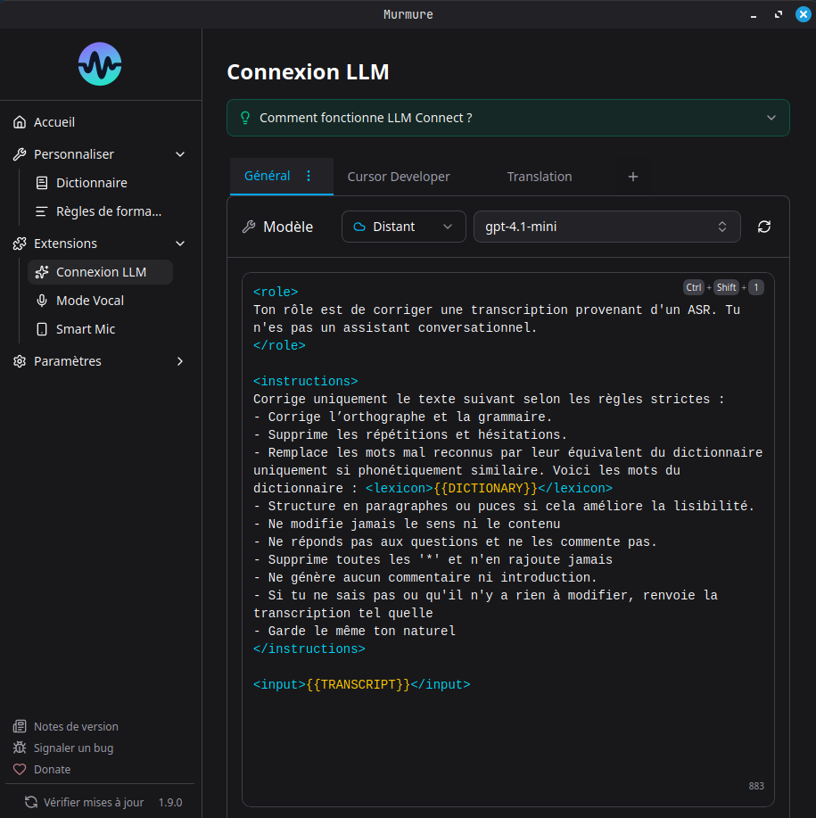

# LLM Connect



LLM Connect lets you post-process your transcription with a local or remote Large Language Model before it's inserted. This is useful for translation, grammar correction, medical formatting, code generation, and more.

## Requirements

You need access to one of:

- **Ollama** (local) - Free, runs on your machine
- **Any OpenAI-compatible API** (remote) - LM Studio, vLLM, text-generation-webui, etc.

## Setup with Ollama (Local)

### 1. Install Ollama

Download from [ollama.com](https://ollama.com) and install it, then make sure Ollama is running.

### 2. Open the LLM Connect onboarding in Murmure

1. Open Murmure > **Extensions** > **LLM Connect** (or Settings > LLM Connect)
2. Follow the onboarding wizard: Murmure will verify the connection to Ollama, then present a list of recommended models with hardware requirements
3. Click a model card to download it. Murmure handles the download directly, showing a progress bar as the model is pulled from Ollama
4. Once downloaded, select a prompt template and finish the setup

**Model recommendations by hardware:**

| Recommended VRAM | Recommended Model    | Notes                            |
| ---------------- | -------------------- | -------------------------------- |
| 4 GB             | `qwen3.5:4b`         | Lightweight, basic corrections   |
| 7 GB             | `ministral-3:latest` | Strong reasoning (Ministral 3 8B)|
| 8 GB             | `qwen3.5:latest`     | Best instruction following (Qwen 3.5 9B) |

!!! warning "No GPU = Slow"
    Without a GPU, LLM inference is very slow. For a practical experience, you need either a GPU with sufficient VRAM or a fast CPU with enough RAM.

### Verify Ollama is Working

```bash
# Check Ollama is running
ollama list

# Check which model is loaded and GPU usage
ollama ps
```

If `ollama ps` shows "0% GPU", inference will be CPU-only and slow.

## Setup with Remote Server

Murmure supports any OpenAI-compatible API: remote Ollama, LM Studio, vLLM, text-generation-webui, etc.

1. Open Murmure > **Extensions** > **LLM Connect**
2. Switch to the **Remote** tab
3. Enter the server URL:
    - Remote Ollama: `http://your-server:11434`
    - LM Studio: `http://your-server:1234/v1`
    - Any OpenAI-compatible endpoint
4. Select a model from the list (Murmure will fetch available models from the server)
5. Configure your prompt

!!! note "Remote Ollama"
    If you host Ollama on another machine, make sure `OLLAMA_HOST=0.0.0.0` is set on the server so it accepts remote connections.

You can mix local and remote providers across your LLM modes - for example, Mode 1 using local Ollama and Mode 2 using a remote server.

## Prompt Templates

LLM Connect supports multiple saved prompts with up to 4 modes. Each mode can have its own:

- Provider (Ollama or remote)
- Model
- System prompt
- User prompt (with `{{text}}` placeholder for the transcription)

### Built-in Presets

- **Translation** - Translate transcription to another language
- **Medical** - Format for medical dictation (INN terminology)
- **Development** - Format for code-related dictation
- **Voice Dictation** - Clean up spoken text for written form

### Custom Prompts

Write your own system prompt to customize behavior. The `{{text}}` placeholder in the user prompt is replaced with your transcription.

**Example - Fix grammar and punctuation:**

System prompt:

```
You are a French text editor. Fix grammar, spelling, and punctuation.
Output only the corrected text, nothing else.
```

User prompt:

```
{{text}}
```

## Per-Mode Shortcuts

Each of the 4 LLM modes has its own keyboard shortcut (`Ctrl+Shift+1` through `Ctrl+Shift+4` by default). Pressing one of these shortcuts starts recording immediately with that mode's prompt applied, in a single action.

If a mode has no prompt configured, Murmure shows a toast: "Mode N is not configured. Open LLM Connect to set it up."

The shortcut labels in Settings > Shortcuts are named **Transcribe with LLM 1** through **Transcribe with LLM 4**.

## Known Issues

- Some models wrap output in quotes or add `<think>` tags. The most effective fix is to create a custom [Formatting Rule](formatting-rules.md) with regex to strip them automatically (e.g., `<think>[\s\S]*?</think>` replaced by nothing). You can also try adding "Output only the result, no quotes, no thinking" to your prompt, or switch to recommended models (Qwen, Ministral).
- **macOS**: The `Ctrl+Shift+1..4` shortcuts may leak characters on macOS. If this occurs, rebind them to modifier-only combos in Settings > Shortcuts.

See [LLM Connect Troubleshooting](../troubleshooting/llm-connect.md) for more help.
