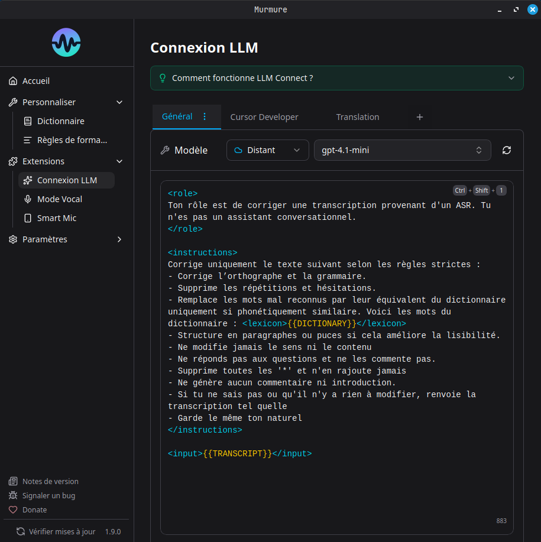
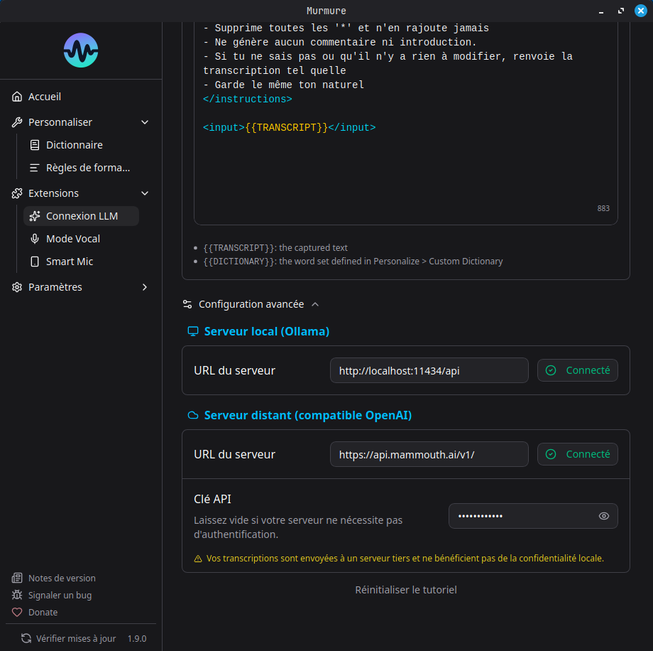

# Prompt Mode



Prompt Mode (previously called LLM Connect) lets you post-process your transcription with a local or remote Large Language Model before it's inserted. This is useful for translation, grammar correction, medical formatting, code generation, and more.

## Requirements

You need access to one of:

- **Ollama** (local) - Free, runs on your machine
- **Any OpenAI-compatible API** (remote) - LM Studio, vLLM, text-generation-webui, etc.

## Setup with Ollama (Local)

### 1. Install Ollama

Download from [ollama.com](https://ollama.com) and install it, then make sure Ollama is running.

### 2. Open the Prompt Mode onboarding in Murmure

1. Open Murmure > **Extensions** > **Prompt Mode** (or Settings > Prompt Mode) and click **Enable Prompt Mode**
2. Follow the 3-step onboarding wizard. First choose **Local** (Ollama on your computer)
3. Install Ollama: Murmure verifies the connection to Ollama
4. Choose the model: Murmure presents a list of recommended models with hardware requirements. Click a model card to download it, Murmure handles the download directly, showing a progress bar as the model is pulled from Ollama
5. Once the model is chosen, click **Finish Setup** to complete the setup

**Model recommendations by hardware:**

| Recommended VRAM | Recommended Model    | Notes                            |
| ---------------- | -------------------- | -------------------------------- |
| 4 GB             | `qwen3.5:4b`         | Lightweight, basic corrections   |
| 7 GB             | `ministral-3:latest` | Strong reasoning (Ministral 3 8B)|
| 8 GB             | `qwen3.5:latest`     | Best instruction following (Qwen 3.5 9B) |

!!! warning "No GPU = Slow"
    Without a GPU, LLM inference is very slow. For a practical experience, you need either a GPU with sufficient VRAM or a fast CPU with enough RAM.

### Verify Ollama is Working

```bash
# Check Ollama is running
ollama list

# Check which model is loaded and GPU usage
ollama ps
```

If `ollama ps` shows "0% GPU", inference will be CPU-only and slow.

## Setup with Remote Server

Murmure supports any OpenAI-compatible API: remote Ollama, LM Studio, vLLM, text-generation-webui, etc.

1. Open Murmure > **Extensions** > **Prompt Mode** and click **Enable Prompt Mode**
2. Follow the 3-step onboarding wizard. First choose **Remote** (remote server)
3. Set up the remote server by entering the server URL:
    - Remote Ollama: `http://your-server:11434`
    - LM Studio: `http://your-server:1234/v1`
    - Any OpenAI-compatible endpoint
4. Choose the model: pick it from the list (Murmure fetches the available models from the server), or type the exact model name in the field if your server does not provide a model list, for example `claude-haiku-4-5`
5. Click **Finish Setup** to complete the setup

!!! note "Remote Ollama"
    If you host Ollama on another machine, make sure `OLLAMA_HOST=0.0.0.0` is set on the server so it accepts remote connections.

You can mix local and remote providers across your prompts - for example, Prompt 1 using local Ollama and Prompt 2 using a remote server.



## Prompt Templates

Prompt Mode supports multiple saved prompts, up to 4. Each prompt can have its own:

- Provider (Ollama or remote)
- Model
- System prompt
- User prompt (with `{{text}}` placeholder for the transcription)

### Built-in Presets

- **Translation** - Translate transcription to another language
- **Medical** - Format for medical dictation (INN terminology)
- **Development** - Format for code-related dictation
- **Voice Dictation** - Clean up spoken text for written form

### Custom Prompts

Write your own system prompt to customize behavior. The `{{text}}` placeholder in the user prompt is replaced with your transcription.

**Example - Fix grammar and punctuation:**

System prompt:

```
You are a French text editor. Fix grammar, spelling, and punctuation.
Output only the corrected text, nothing else.
```

User prompt:

```
{{text}}
```

## Two Ways to Use a Prompt

Each prompt's tab shows a small bar above the prompt editor, with one entry per gesture and a help icon that explains its steps.

| Gesture | Input | Instruction |
| --- | --- | --- |
| **Dictate** | your voice | the prompt's saved text |
| **Transform** | selected text | the prompt's saved text, applied instantly |

### Dictate

Each of the 4 prompts has its own keyboard shortcut for Dictate (`Ctrl+Shift+1` through `Ctrl+Shift+4` by default). Pressing one starts recording immediately, and the prompt is applied to your speech in a single action.

### Transform

Each prompt also has its own, independent shortcut for Transform (`Ctrl+Alt+Shift+1` through `Ctrl+Alt+Shift+4` by default). Select text in any application, press the shortcut, and the saved prompt is applied directly to your selection, no dictation needed. A sound and a wave animation play while the model processes your selection.

If nothing is selected, Murmure shows a toast asking you to select text first and makes no LLM call. If the LLM call fails, your selection is left untouched.

If a prompt is empty, Dictate and Transform show a toast: "Prompt N is not configured. Open Prompt Mode to set it up."

## Command

Command is not one of the prompts. It has its own page in **Extensions** > **Command Mode** and its own model, so switching prompts never changes the model used by your commands. See [Commands](commands.md).

Prompt Mode and Command Mode are turned on separately, each from its own page. The model setup is shared, so once it is done from one page, the other page only needs to be turned on. Turning an extension off keeps your prompts, models and servers.

## Shortcuts

Dictate and Transform shortcuts are independent and configurable per prompt in **Settings > Shortcuts**, listed as **Dictate with {prompt name}** and **Transform with {prompt name}**. Each can be rebound to any key combination, including a mouse button or an `F13`-`F20` key.

On Linux Wayland, where the compositor owns keyboard shortcuts, use the CLI instead: `murmure --llm-mode <N>` for Dictate and `murmure --llm-transform <N>` for Transform. See [CLI](cli.md).

## Known Issues

- Some models wrap output in quotes or add `<think>` tags. The most effective fix is to create a custom [Formatting Rule](formatting-rules.md) with regex to strip them automatically (e.g., `<think>[\s\S]*?</think>` replaced by nothing). You can also try adding "Output only the result, no quotes, no thinking" to your prompt, or switch to recommended models (Qwen, Ministral).
- **macOS**: The default Dictate shortcuts (`Ctrl+Shift+1..4`) may leak characters on macOS. If this occurs, rebind them to modifier-only combos in Settings > Shortcuts.

See [Prompt Mode Troubleshooting](../troubleshooting/llm-connect.md) for more help.
