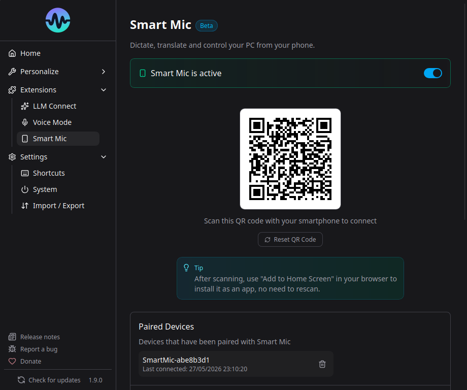

# Smart Speech Mic



Smart Speech Mic transforme n'importe quel smartphone en microphone sans fil pour Murmure. Aucune installation requise sur le telephone - scannez simplement un QR code.

## Fonctionnement

1. Murmure demarre un serveur HTTPS local sur votre ordinateur
2. Un QR code s'affiche dans l'application
3. Vous scannez le QR code avec votre telephone
4. Votre telephone ouvre une page web qui diffuse l'audio vers Murmure via WebSocket
5. Murmure utilise l'audio du telephone comme entree microphone

## Mise en place

1. Allez dans **Extensions** > **Smart Speech Mic**
2. Activez Smart Speech Mic
3. Un QR code apparait
4. Scannez-le avec votre telephone (les deux appareils doivent etre sur le meme reseau)
5. Autorisez l'acces au microphone dans le navigateur du telephone
6. Enregistrez dans Murmure comme d'habitude

## Vues du telephone

L'interface web du telephone propose trois onglets en haut de l'ecran, chacun offrant une facon differente d'utiliser Smart Speech Mic. La vue active est memorisee entre les sessions, le telephone reouvre donc l'application sur le dernier onglet utilise.

### Remote

Le mode par defaut. Votre telephone sert de microphone sans fil et de telecommande pour Murmure :

- Le bouton **REC** diffuse votre voix vers l'ordinateur et colle la transcription dans le champ texte actif
- Le **trackpad** controle le pointeur de la souris (tap pour cliquer, appui long pour clic droit)
- Les boutons **Entree** et **Retour arriere** envoient des evenements clavier a l'ordinateur

Utilisez ce mode pour la dictee mains libres quand le texte doit apparaitre directement dans une application de l'ordinateur.

### Transcription

Un historique chronologique des transcriptions affiche sur le telephone. Utile quand vous voulez lire ou partager ce qui a ete dicte sans l'envoyer a une application specifique sur l'ordinateur.

- Chaque transcription est horodatee
- Touchez une entree pour copier son texte dans le presse-papiers du telephone
- Le bouton **Tout copier** copie l'historique complet en une fois
- Le menu a trois points permet d'effacer l'historique

### Translation

Traduction bidirectionnelle entre deux langues, affichee sous forme de bulles de chat. Choisissez la paire de langues en haut de la vue, appuyez sur **REC**, et parlez. Chaque prise de parole est detectee, traduite, et affichee du bon cote.

- La paire de langues selectionnee est memorisee entre les sessions
- Les messages de chaque langue apparaissent de cotes opposes dans la conversation
- Une bulle clignotante indique une traduction en cours

L'interface web du telephone est disponible en plusieurs langues et suit la langue du navigateur du telephone (vous pouvez aussi en forcer une via le parametre d'URL `?lang=`).

## Pre-requis

- Les deux appareils doivent etre sur le **meme reseau local** (Wi-Fi)
- Votre telephone a besoin d'un navigateur moderne (Chrome, Safari, Firefox)
- La permission microphone doit etre accordee dans le navigateur

## Securite

- Communication chiffree via TLS (HTTPS + WSS)
- Certificats auto-signes generes localement
- Appairage par tokens stockes dans le trousseau natif du systeme
- Aucune donnee ne quitte votre reseau local

## Gestion des appareils appaires

Vous pouvez voir et supprimer les appareils appaires dans les parametres Smart Speech Mic. Supprimer un appareil revoque son token.

## Configuration

- **Port** : Le port du serveur peut etre change si le port par defaut entre en conflit
- **Adresse d'ecoute** : Dans les **Parametres avances**, choisissez l'interface reseau sur laquelle le serveur Smart Mic doit ecouter. Laissez **Auto** (par defaut) dans la plupart des cas, ou choisissez une IP specifique pour forcer le trafic a passer par une interface precise (VPN, LAN dedie, etc.)
- **Activer/Desactiver** : Activez ou desactivez le serveur Smart Mic selon vos besoins

## Acces distant

Par defaut, Smart Speech Mic fonctionne sur votre reseau local. Pour un acces distant (depuis un autre reseau, en 4G/5G, etc.), vous pouvez configurer un relais dans les **Parametres avances**.

### Option 1 : Segmentation reseau (Entreprise)

L'approche la plus simple pour les hopitaux et les entreprises. Aucune modification necessaire dans Murmure.

Votre service informatique cree un reseau Wi-Fi dedie au personnel avec des regles de pare-feu autorisant le trafic uniquement sur le port de Murmure (par defaut : 4801) vers le reseau des postes de travail. Par exemple :

```
Wi-Fi Personnel (10.0.1.0/24)       Reseau Prive (192.168.1.0/24)
   Telephone (10.0.1.50)    ------>    Poste (192.168.1.100:4801)
                             Regle pare-feu :
                             ALLOW 10.0.1.0/24 -> 192.168.1.0/24 port 4801
                             DENY tout le reste
```

Le telephone se connecte au Wi-Fi personnel, scanne le QR code, et se connecte directement au poste de travail. Un attaquant devrait etre physiquement present, authentifie sur le Wi-Fi personnel, et exploiter une vulnerabilite sur le port specifique de Murmure.

### Option 2 : Reverse Proxy avec SSO (Entreprise)

Pour les organisations qui ne peuvent pas mettre les telephones du personnel sur un segment reseau avec acces aux postes de travail, un reverse proxy (Nginx, Caddy) peut acheminer le trafic depuis un point d'acces externe vers les instances Murmure internes.

**Dans Murmure :**

1. Definissez l'**URL du relais** avec l'adresse de votre proxy (ex. `https://smartmic.hopital.fr`)
2. Activez l'**Identifiant machine** pour inclure un identifiant dans l'URL
3. Le QR code encodera : `https://smartmic.hopital.fr/pc-urgences-01/?token=...`

**Cote service informatique**, un exemple de configuration Nginx :

```nginx
server {
    listen 443 ssl;
    server_name smartmic.hopital.fr;

    # oauth2-proxy gere l'authentification Keycloak
    location /oauth2/ {
        proxy_pass http://127.0.0.1:4180;
    }

    # Route /{identifiant-machine}/* vers le poste correspondant
    location ~ ^/(?<machine>[^/?]+)(?<rest>/.*)?$ {
        auth_request /oauth2/auth;
        error_page 401 = /oauth2/sign_in?rd=$scheme://$host$request_uri;

        proxy_pass https://$machine.internal.hopital.fr:4801$rest;
        proxy_ssl_verify off;
        proxy_http_version 1.1;
        proxy_set_header Upgrade $http_upgrade;
        proxy_set_header Connection "upgrade";
    }
}
```

Le proxy resout le nom de machine via le DNS interne (ex. `pc-urgences-01.internal.hopital.fr`), transmet le trafic WebSocket, et gere l'authentification SSO. Les telephones du personnel se connectent depuis n'importe quel reseau (Wi-Fi invite, 4G) sans acceder directement au reseau interne.

### Option 3 : Tunnel Cloud (Personnel)

Pour un usage personnel, [Cloudflare Tunnel](https://developers.cloudflare.com/tunnel/) est l'option la plus simple. Il cree une connexion sortante securisee depuis votre ordinateur vers le reseau Cloudflare, vous donnant une URL publique sans ouvrir aucun port.

**Etape 1 : Installer `cloudflared`**

Telechargez le binaire pour votre systeme depuis la [page officielle de telechargement Cloudflare](https://developers.cloudflare.com/cloudflare-one/connections/connect-networks/downloads/).

**Etape 2 : Demarrer le tunnel**

```bash
cloudflared tunnel --url https://localhost:4801 --no-tls-verify
```

Le flag `--no-tls-verify` est necessaire car Murmure utilise un certificat auto-signe pour son serveur local.

Vous verrez une sortie comme :

```
+--------------------------------------------------------------------------------------------+
|  Your quick Tunnel has been created! Visit it at (it may take some time to be reachable):  |
|  https://random-name-here.trycloudflare.com                                               |
+--------------------------------------------------------------------------------------------+
```

**Etape 3 : Configurer Murmure**

1. Copiez l'URL generee (ex. `https://random-name-here.trycloudflare.com`)
2. Ouvrez Murmure > Smart Speech Mic > **Parametres avances**
3. Collez l'URL dans le champ **URL du relais**
4. Laissez l'**Identifiant machine** desactive (il n'est pas necessaire pour un usage personnel)
5. Scannez le QR code depuis votre telephone sur n'importe quel reseau (4G, autre Wi-Fi, etc.)

Le tunnel reste actif tant que la commande `cloudflared` tourne. Fermez-le avec `Ctrl+C` quand vous avez termine.

!!! warning
    Lors de l'utilisation d'un tunnel cloud, vos donnees audio transitent par les serveurs du fournisseur de tunnel (Cloudflare dans ce cas). Pour les donnees medicales ou sensibles (conformite RGPD, HDS), utilisez une solution auto-hebergee (Option 1 ou 2).

### Expiration des tokens

Dans les Parametres avances, vous pouvez definir une **Expiration du token** (en heures). Une fois definie, les appareils appaires sont automatiquement revoques apres la duree specifiee. Mettez 0 pour aucune expiration (par defaut).

Cette option est utile dans les environnements partages (hopitaux, postes de travail partages) ou les sessions doivent etre limitees dans le temps.
