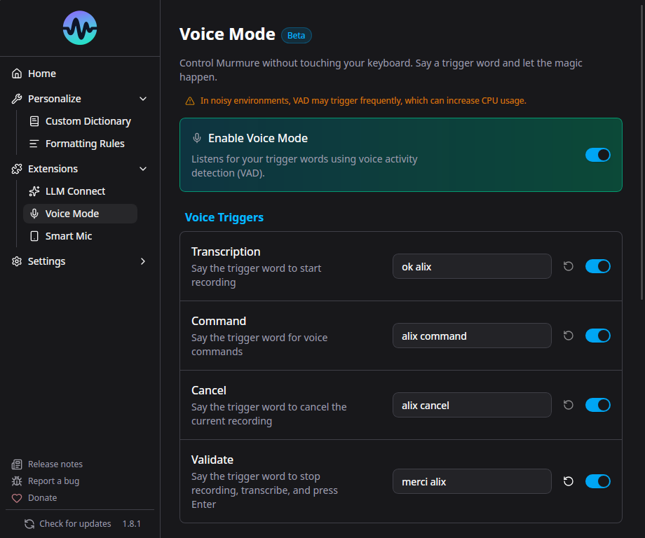

# Voice Mode

!!! info "Beta Feature"
    Voice Mode is a beta feature introduced in v1.8.0. It may use significant CPU resources.

Voice Mode lets you activate Murmure with your voice instead of a keyboard shortcut. Say a wake word and Murmure starts recording - completely hands-free.

## How It Works

1. Murmure monitors ambient sound levels using Voice Activity Detection (VAD)
2. When sufficient audio activity is detected (someone speaking), it triggers a local transcription
3. If the transcription matches your wake word, recording starts
4. Recording stops after a configurable silence timeout
5. The transcription is processed and inserted (wake word is stripped from the output)

## Setup

1. Go to **Extensions** > **Voice Mode** (or Settings > Voice Mode)
2. Enable Voice Mode
3. Set your wake words for each action

## Wake Word Actions

| Action | Description | Example Wake Word |
|---|---|---|
| **Record** | Start standard transcription | "Murmure" |
| **Record LLM Mode 1-4** | Start transcription with a specific LLM mode | "Murmure traduis" |
| **Record Command** | Start command mode | "Murmure commande" |
| **Cancel** | Cancel current recording | "Annuler" |
| **Validate** | Finish recording and submit | "Terminé" |

## Tips

- **Choose distinctive wake words** - Avoid common words that appear in normal speech
- **Multi-word wake words are more reliable** - "OK Murmure" is better than just "Murmure"
- **Speak the wake word clearly** - The fuzzy matching allows for slight variations but not complete mispronunciations

## Auto-Enter

When enabled, Murmure automatically presses `Enter` after inserting the transcription. This is useful for chat applications or command prompts where you want to send the message immediately.

Configure in Voice Mode settings: **Auto-enter after wake word**.

## Silence Timeout

The silence timeout controls how long Murmure waits after you stop speaking before ending the recording. Default is 1.5 seconds. Increase it if your recordings are being cut short.

## CPU Usage Warning

Voice Mode continuously processes audio in the background, which uses CPU resources. This is expected behavior. If you're in a noisy environment (like a meeting), CPU usage will be higher because the VAD detects more speech to process.

**Recommendation**: Disable Voice Mode when you don't need it, especially during meetings or in noisy environments.
