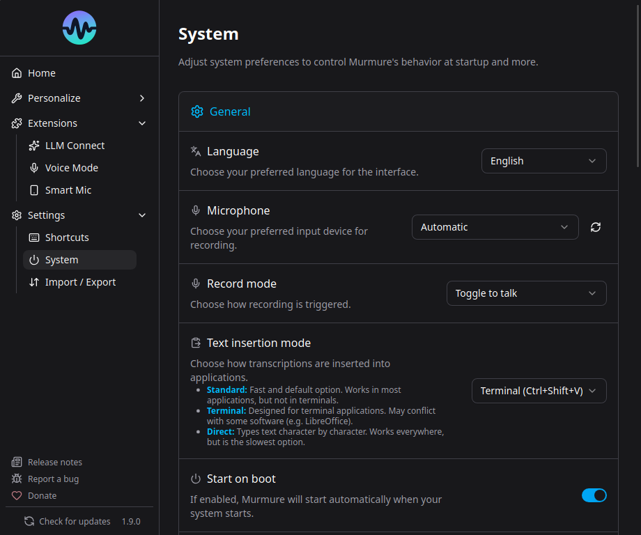
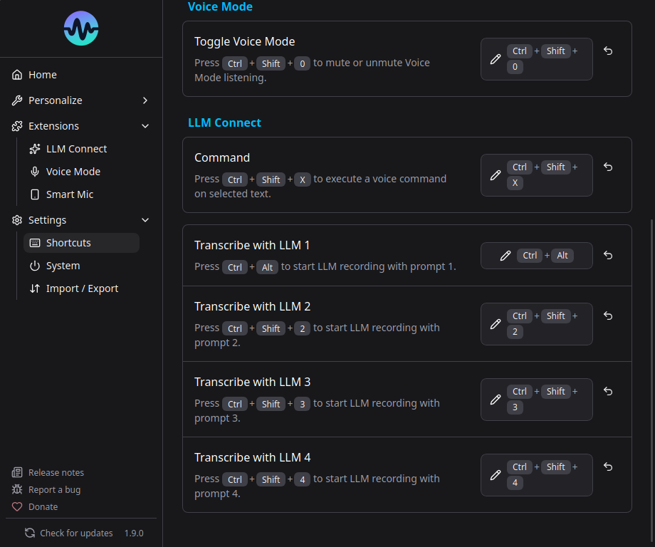

# Premiers pas

Apres avoir installe Murmure, voici comment en tirer le meilleur parti.

## Votre premiere transcription

1. Ouvrez un champ de texte (navigateur, editeur, messagerie)
2. Appuyez sur `Ctrl+Espace` (raccourci par defaut)
3. Parlez clairement dans votre microphone
4. Relachez le raccourci (ou appuyez a nouveau en mode toggle)
5. Le texte apparait dans l'application active

!!! tip
    La premiere transcription apres le lancement est un peu plus lente car le modele IA doit se charger. Les suivantes sont plus rapides.

## Choisir le mode d'enregistrement

Allez dans **Parametres** > **Systeme** pour choisir un mode :

| Mode                      | Fonctionnement                                                 |
| ------------------------- | -------------------------------------------------------------- |
| **Push-to-talk** (defaut) | Maintenez le raccourci pour enregistrer, relachez pour arreter |
| **Toggle-to-talk**        | Appuyez une fois pour demarrer, une fois pour arreter          |

Pour l'enregistrement mains libres par mot-cle, voir [Mode vocal](../features/voice-mode.md) (fonctionnalite separee dans Extensions).

## Selectionner le microphone

Par defaut, Murmure utilise le microphone systeme. Pour en choisir un specifique :

1. Allez dans **Parametres** > **Systeme**
2. Sous **Microphone**, selectionnez l'appareil souhaite

!!! warning "Microphones virtuels"
    Si vous utilisez un microphone virtuel (NVIDIA Broadcast, VB-Audio, etc.), selectionnez-le explicitement. L'option "Automatique" peut ne pas le detecter.

## Configurer le raccourci

Le raccourci par defaut `Ctrl+Espace` peut entrer en conflit avec d'autres applications. Pour le changer :

1. Allez dans **Parametres** > **Raccourcis**
2. Cliquez sur le champ du raccourci et appuyez sur la combinaison souhaitee

**Raccourcis recommandes par OS :**

| OS          | Recommande                                                                 | A eviter                                       |
| ----------- | -------------------------------------------------------------------------- | ---------------------------------------------- |
| Windows     | `Ctrl+Espace`, `Ctrl+Alt+M`, `F2`, bouton lateral/supplementaire de souris | Combinaisons AltGr (interprete comme Ctrl+Alt) |
| macOS       | `Ctrl+Option+M`, `F2`, `F3`, bouton lateral/supplementaire de souris       | Espace ou chiffres                             |
| Linux (X11) | `Ctrl+Espace`, `F2`, bouton lateral/supplementaire de souris               | -                                              |

## Modes d'insertion du texte

Si le texte ne s'affiche pas dans certaines applications, changez le mode d'insertion :

Allez dans **Parametres** > **Systeme** > **Mode d'insertion du texte** :

| Mode                        | Fonctionnement                               | Ideal pour                  |
| --------------------------- | -------------------------------------------- | --------------------------- |
| **Standard** (Ctrl+V)       | Copie dans le presse-papier et simule Ctrl+V | La plupart des applications |
| **Terminal** (Ctrl+Shift+V) | Collage style terminal                       | Emulateurs de terminal      |
| **Direct** (saisie texte)   | Simule les frappes individuelles             | LibreOffice, Git Bash       |

!!! tip
    Si le texte n'apparait pas apres transcription, essayez le mode **Direct**. Voir [Depannage insertion texte](../troubleshooting/text-insertion.md).

## Demarrage automatique

Allez dans **Parametres** > **Systeme** et activez **Lancer au demarrage**. Murmure demarrera reduit dans la barre systeme.

## Et ensuite ?

- [Dictionnaire](../features/dictionary.md) - Ajouter des mots pour une meilleure reconnaissance
- [Regles de formatage](../features/formatting-rules.md) - Corriger et transformer le texte automatiquement
- [LLM Connect](../features/llm-connect.md) - Post-traitement avec une IA locale
- [Mode vocal](../features/voice-mode.md) - Activation mains libres par mot-cle
- [Smart Speech Mic](../features/smart-speech-mic.md) - Votre telephone comme micro sans fil
