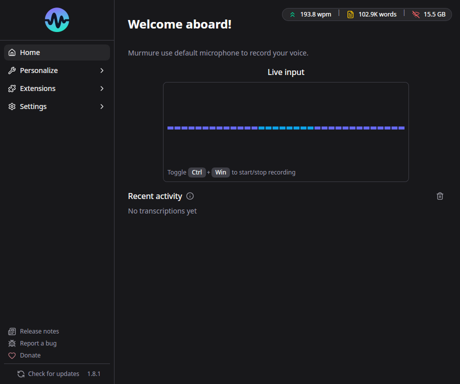

# Documentation Murmure

**Murmure** est une application de reconnaissance vocale open-source et respectueuse de la vie privee, qui fonctionne entierement sur votre machine. Propulsee par le modele [Parakeet TDT 0.6B v3](https://huggingface.co/nvidia/parakeet-tdt-0.6b-v3) de NVIDIA, elle offre une transcription rapide et locale, sans connexion internet et sans collecte de donnees.

## Pourquoi Murmure ?

- **Vie privee** - Tout le traitement se fait localement. Aucune donnee ne quitte votre ordinateur.
- **Zero telemetrie** - Aucun tracking, aucune analyse.
- **Open Source** - Logiciel libre et gratuit (GNU AGPL v3).
- **Multilingue** - Supporte 25 langues europeennes.
- **Hors ligne** - Aucune connexion internet requise.

## Langues supportees

Bulgare, croate, tcheque, danois, neerlandais, anglais, estonien, finnois, francais, allemand, grec, hongrois, italien, letton, lituanien, maltais, polonais, portugais, roumain, slovaque, slovene, espagnol, suedois, russe, ukrainien.

## Liens rapides

- [Demarrage rapide](getting-started/windows.md) - Installer Murmure sur votre OS
- [Fonctionnalites](features/transcription.md) - Decouvrir toutes les fonctionnalites
- [Depannage](troubleshooting/index.md) - Resoudre les problemes courants
- [FAQ](faq.md) - Questions frequentes
- [Depot GitHub](https://github.com/Kieirra/murmure)
- [Site officiel](https://murmure.al1x-ai.com/)
